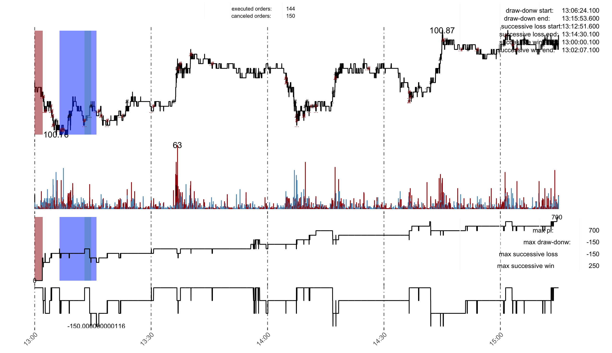
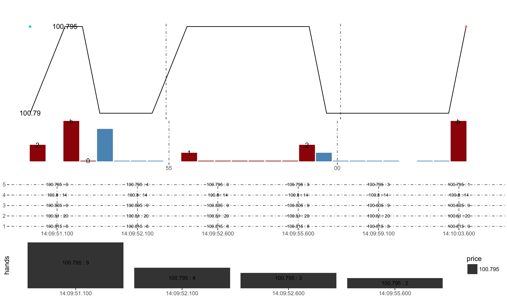

HFT, A high-frequency trading simulation package in R.
=======
The goal of HFT is to make it easy to write and test high-frequency trading strategies.

This package provides a simulated environment with most of the realworld operating rules. It also offers varies of order submitting, order flow tracking and summarization functions to simplify strategy writting process. After the simualtion, all intermediate information can be easily fetched and analyzed.


### Installation
```R
library(devtools)
install_github("chenhaotian/High-Frequency-Trading-Simulation-System")
```

### Getting Started
Let's first show how it works by a simple demonstration:

Assume a market-maker believe that the order flow of 03/16 treasury future contract(TF1603) has a strong positive auto-correlation. To avoid risk exposure and increase profit margin, the market-maker plan to place a buy/sell limit open order at bid1/ask1 whenever there is a relatively large spread and a small seller/buyer initiated transaction amount. All open orders will be canceled if they haven't been executed for 10 seconds. 

The general usages is:
```
HFTsimulator(stg = strategy function,
             instrumentids = securities identifiers,
             datalist = TAQ data,
             formatlist = TAQ data format)
```
To start the simulation, one first need to prepare **a strategy function**, **security identifiers**, a **TAQ data set** and a **format specification**. 

The security identifiers must be in accordance with the corresponding column in TAQ data, the column index is specified in TAQ data formant. Multiple securitied should be put into a character vector. Though this way of parameterization seems verbose, it makes it possible for the simulator to support any kind of TAQ data sets. There's only one security  named 'TF1603' in the demo, so the security identifier should be specified as `instrumentid='TF1603'`.

The TAQ data and format specification in the demo is contained in the package, they are named 'TFtaq' and 'TFformat' respectively, type `?TFtaq` and `?TFformat` for a rough idea of them, more details will be explained in later sections.

The most important part is the strategy function, `HFTsimulator()` handles the strategy the same way as a [call back function](https://en.wikipedia.org/wiki/Callback_(computer_programming). The function will be called at every arrival of a new data stream, details will be explained later. The demo strategy function should be written as follow:

```R
## a unrealistic demo strategy
DemoStrategy <- function(){
    bsi <- BSI(lastprice=lastprice,bid1 = preorderbook$buybook$price[1],ask1 = preorderbook$sellbook$price[1],volume = volume) # BSI return a length-two vetor representing the amount initiated by buyer and seller
    spread <- orderbook$sellbook$price[1]-orderbook$buybook$price[1] # bid-ask-spread
    if( spread>0.01 & bsi[2]<20 & S("TF1603",longopen.non)){
        ## profit margin is big, seller initiated amount is small, and there is no long open order in queue.
        timeoutsubmission(instrumentid="TF1603",direction = 1,orderid = randomid(5),
                          price = orderbook$buybook$price[1],hands = 1,
                          action = "open",timeoutsleep = 10) #submit a long open order, canceled it if no execution in 10 seconds.
    }
    else if(spread>0.01 & bsi[1]<20 & S("TF1603",shortopen.non)){
        ## profit margin is big, buyer initiated amount is small, and there is no short open order in queue.
        timeoutsubmission(instrumentid="TF1603",direction = -1,orderid = randomid(5),
                          price = orderbook$sellbook$price[1],hands = 1,
                          action = "open",timeoutsleep = 10) #submit a short open order, canceled it if no execution in 10 seconds.
    }
    chasecloseall("TF1603",chasesleep = 1) # close all open positions.
}
```
After all the materials are prepared, simulation starts as follow:
```R
library(HFT)
## start simulation
res1 <- HFTsimulator(stg = DemoStrategy,        #strategy function
                     instrumentids = "TF1603",  #security id(s)
                     datalist = TFtaq,          #TAQ data
                     formatlist = TFformat)     #TAQ data format
```
All order and capital change records will be stored in res1, type `names(res1)` will get:
```R
> names(res1)
[1] "orderhistory" "capitalhistory" "queuingorders" "capital" "verbosepriors"
```
+ **orderhistory**: a data.frame contains all the order change records, each record is with a status code taking values from one of `c(3,5,6,1,0)`, representing `'initial submit','canceled','failed','partially executed' and 'executed'` respectively. type `head(res1$orderhistory)` for a quick look of all the components.
+ **capitalhisory**: a data.frame contains all capital change records. type `head(res1$capitalhistory)` for a quick look.
+ **queuingorders**: a data.frame of currently queuing orders, if `nrow(queuingorders)` is greater than zero, that means there are orders still queuing at the end of the simulation.
+ **capital**: a data.frame contains the final capital summary, including the final positions and cash status.
+ **verbosepriors**: verbose informations of limit orders' queuing status, will be explained in detail later.

So far we have get all the informations generated by the simulator, it would be prefered to present the result in a visualized manner. Here is a set of visualization functions(which are too disordered to be put into the package) that can help us get a quick view of how deep the simulation details can be displayed:
```R
library(devtools)
source_url("https://raw.githubusercontent.com/chenhaotian/High-Frequency-Trading-Simulation-System/master/miscellaneous.r") #source from github

res2 <- tradesummary(TFtaq,"TF1603",starttime = "13:00:00.000",endtime = "15:15:00.000") #summary plot
```
Running the previous statement will get a graph of the strategy's summary graph:


There are four parts from top to bottom in the graph, they are price quotes, trading volume, P&L and draw-down respectively. The succseeive win and lose regin have been highlighted with red and blue in part 1 and 3. In part 2, each bar is filled with red or blue to represent they are initiated by buyers or sellers. Also, there are three tables summarizing order execution and P&L informations showing in the top middle/top right/bottom right of the graph. Details are stored in `res2`, type `names(res2)` for more information.

Simulator also contains information about how each limit order's status evolvement in the order book. Here's an example:
```R
checklimit(instrumentdata = TFtaq,orderid = res2$traded$orderid[81]) #check the 81st traded limit order's life experience
```

Like `tradesummary()`, the graph printed by `checklimit()` also contains four pars, the first two pars are the same with the previous graph. The third part is all the orderbook change during the life interval of the 81st order, the fourth part is the amount change queuing ahead of the 81st order in the orderbook. In this example, it is shown in the graph that the short open order was submitted at 14:09:51.1 with price 100.795, there are 9 orders queuing ahead of it in the order book. The order is executed by a size-5 buyer initiated transaction at 14:09:55.6.
